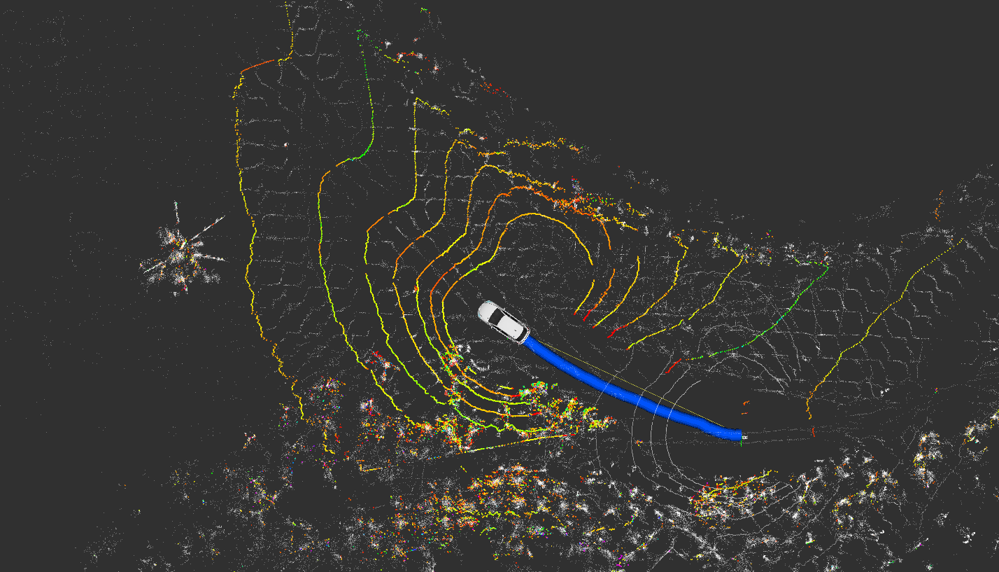
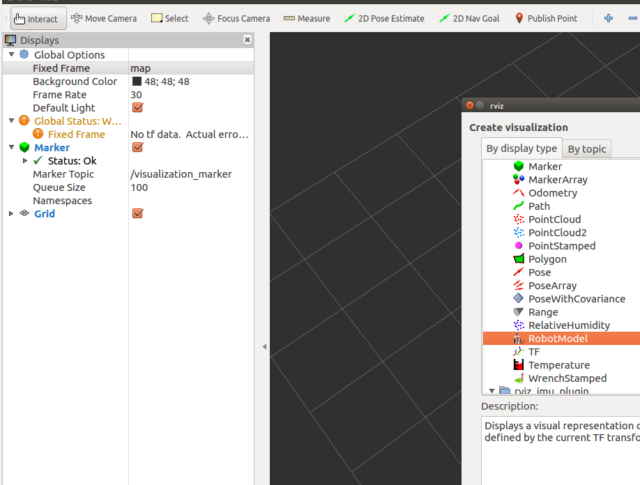

## Instrution

this package is extracted from Autoware.Auto



## Usage:

1. copy the package in your catkin workspace
2. in your launch file，add the following code

```xml
 <include file="$(find vehicle_description)/launch/lexus.launch"/>
```

3. in your rviz gui，you can add the RobotModel in the left

